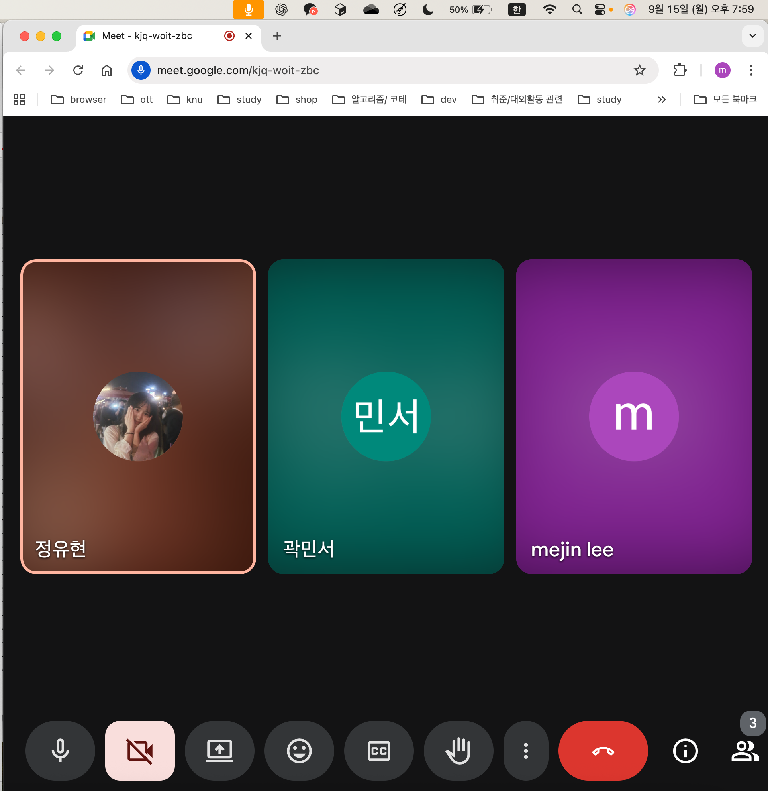

### 회의 이름

0911_2차 팀원회의

### 일시

2025.09.15

### 장소

비대면 회의 ( 구글미트 )

### 참석자

정유현, 이미진, 곽민서

### 회의록 작성자

곽민서

---

### **회의 목적**

계획 발표 자료 마무리 검수 및 수행계획서 작성 계획

### **회의 안건**

1. 계획 발표 PPT 개인 수정 부분 검수 및 마무리
2. 수행 계획서 작성 계획
3. 발표 스크립트 확인

### 회의 내용

- PPT 다같이 확인 후 열린 게시판에 제출 완료
  - 사진 피드백에 따라 공장 사진 추가
  - 실제 비슷한 회사를 찾아 예시 시각화 이미지 추가
  - 바이브 코딩 내용 추가
  - 학회 명확히 지정
- 수행 계획서 분담
  - 1번 항목 : 곽민서
  - 2번 항목 : 정유현
  - 3번/5번 항목 : 회의 중 작성 완료
  - 4번 항목 : 이미진
    - 개별 작성 항목은 수요일 자정까지 작성 후 카카오톡에 올려 공유 및 상호 피드백 예정
  - 5번 항목 예산안
    - 한국 통신 학회 (KICS) 가입비와 학부생 논문 등록 비용
    - 한국 통신 학회 발표 참석 교통비
    - 멘토 대면 회의(광주 광역시 또는 나주시 예정) 교통비
   
- 다음 회의(22일 21시)에 수행 계획서 마무리 후 제출 예정

### 회의 결과 또는 내용 요약

- 수요일 자정까지 개별 수행 계획서 파트 작성 후 취합, 피드백
  
---

### 다음 회의 일정

22일 오후 9시 구글미트 예정 (팀원은 동의, 멘토님은 가부 예정 추후 통지)

### 비고

